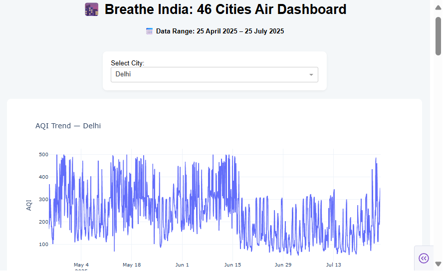
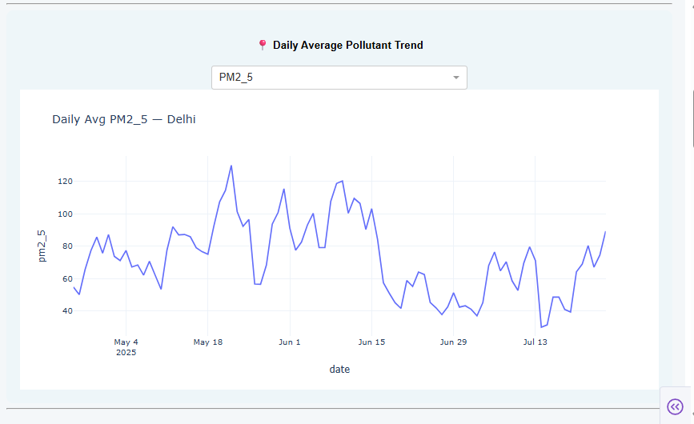
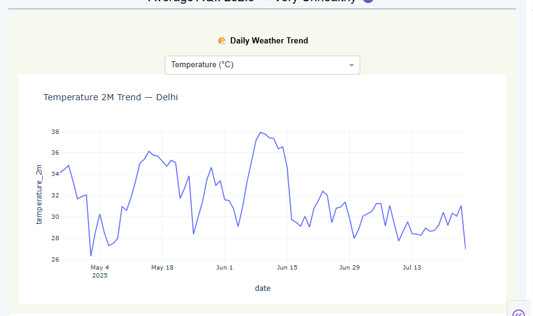
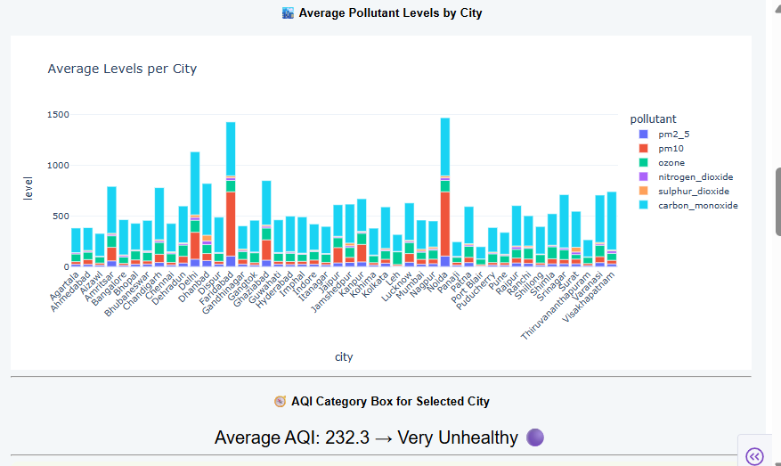
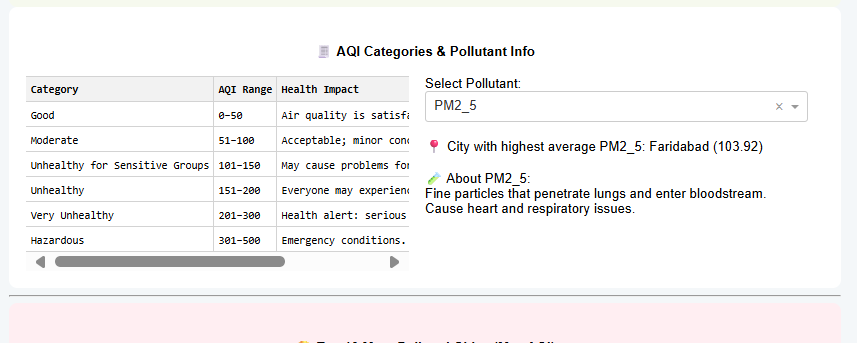
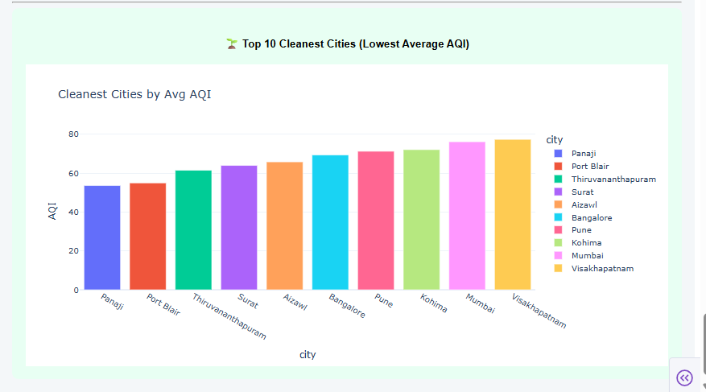
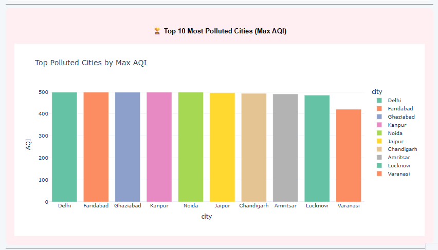

# 🌆 Breathe India: Air Quality Dashboard  

## 📖 Project Overview  
This project explores **air quality across 46 Indian cities** using open APIs and provides an **interactive dashboard** built with Plotly Dash. The aim is to **analyze, visualize, and communicate** insights about pollution, weather, and health impact in an intuitive way.  

The work is divided into **three stages**:  
1. **Data Collection & Preprocessing** – Automated data extraction via APIs (air quality & weather), cleaning, and preparation.  
2. **Exploratory Data Analysis (EDA)** – Statistical summaries, trends, and visual exploration of pollutants across time and cities.  
3. **Interactive Dashboard** – A web-based dashboard to visualize pollution trends, weather correlations, and health implications.  

---

## ✨ Key Features of Dashboard  
- 📊 **Time-series pollutant trends** for selected cities    
- 🏆 **Top 10 most polluted & cleanest cities**  
- 🌤️ **Weather-pollution relationship** (Temperature, Humidity, Wind, Precipitation)  
- 📋 **AQI categories table** with health impact descriptions  
- 🔍 **Pollutant-specific insights** (select a pollutant → see which city has the highest levels + description of its effects)  

---

## 🛠️ Skills Demonstrated  
This project highlights a **data science workflow**, including:  

### 🔹 Data Engineering  
- Working with **APIs** for data collection  
- Handling **large datasets (1GB+)** efficiently  
- Data cleaning, preprocessing, and feature engineering  

### 🔹 Data Analysis & Visualization  
- Exploratory Data Analysis (EDA) with **Pandas, Matplotlib, Seaborn, Plotly**  
- Statistical summaries and visual exploration of trends  
- Identifying **seasonal and spatial patterns** in air pollution  

### 🔹 Dashboard Development  
- Built an **interactive web dashboard** with **Plotly Dash**  
- Integrated multiple components: dropdowns, maps, time-series, bar charts, tables  
- Customized UI with layouts, sections, and styling for clarity  

### 🔹 Deployment   
- Organized project into **modular notebooks and scripts**  
- Created `requirements.txt` and `Procfile` for deployment  
- Version-controlled via **Git & GitHub**  

---

## 🎥 Dashboard Demo  
Check out the demo video of the dashboard here:  

👉 Vodeo: [Dashboard Demo](Dashboard%20Demo.mp4)  

Images: 

[]
[]
[]
[]
[]
[]
[]

---

## 🧰 Tech Stack  
- **Languages**: Python  
- **Libraries**: Pandas, NumPy, Plotly, Dash, Seaborn, Matplotlib  
- **Data Sources**: Air Quality API, Weather API  
- **Version Control**: Git, GitHub  

---
## 🚀 How to Run the Dashboard Locally  
1. Clone this repo:  
   ```bash
   git clone https://github.com/your-username/air-quality-dashboard.git
   cd air-quality-dashboard
2. Install dependencies:
   pip install -r requirements.txt
3. Run the dashboard:
   python Dashboard.py
4. Open browser at http://127.0.0.1:8050/

---

## 📌 Insights & Learnings
- Delhi consistently ranks among the top polluted cities.
- Meteorological factors like wind speed and precipitation significantly reduce AQI.
- PM2.5 remains the most dangerous pollutant across cities due to its health risks.
- Developed skills in API integration, EDA, dashboarding, and deployment — covering the lifecycle of a data science project.

----

## 📜 License  
This project is licensed under the **Apache License 2.0** – you may use, distribute, and modify it freely, provided that proper attribution and a copy of the license are included.  

See the [LICENSE](LICENSE) file for details. 

---

## 🙋 Author
👤 Aayushi Kumari

📧 Email: gupaayu053@gmail.com

💼 LinkedIn: https://www.linkedin.com/in/aayushi-kumari-562b2a147/
